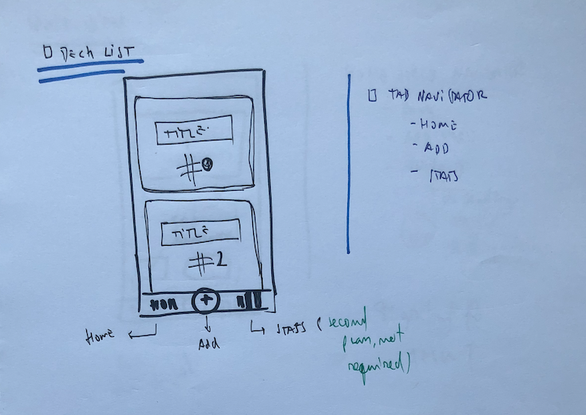
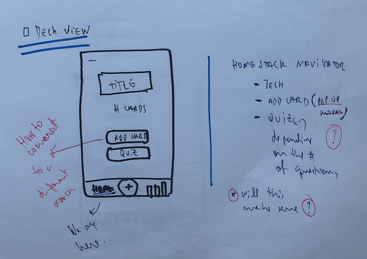
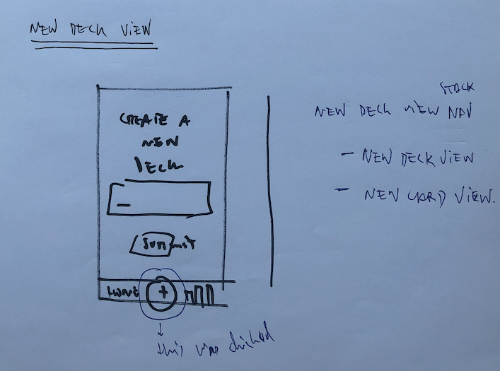
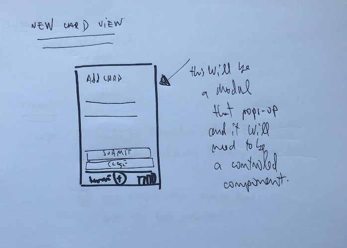

# Flashcards - A App built with React Native

This is UDACITY React nanodegree capstone project #3.

## Installation

To get started and test my project do as follows:

- install project dependencies with `yarn install` or `npm install`
- start the development server with `yarn start` or `npm start`

## The Project approach

This time around I was a little bit more clumsy in the way I planed building this app. I didn't necessarily follow through the recommendations and jump a couple of things that I learn to like thinking on the fly instead of putting together a very sophisticated and detailed plan. In short, I was more keen to code than to think...Def don't recommend that for more complex applications as this will lead to a lot of rework.

Having said that I clearly had in my mind a plan, and idea on how I should go about doing this:

1. 📐 Draw the app views;
2. 📲 Thought about how they would flow and connect;
3. 🧰 More or less broke down how the differ component's will build the views;
4. 📉 Barely thought about the data...

For me the drawing piece is always one of the most interesting ones, so let's just jump into it.

## 📐 Draw the app views

In my mind I needed to have a couple of views that would create a swift user experience for which the user wouldn't need explanation. For that I created 5 screens that don't necessarily translate to the components, but were the basis for me to start coding.

### Deck List View

This is the view and not necessarily

### Deck View

### New Deck View

### New Card View

### Quiz View

## 📲 Thought about how they would flow and connect

## 🧰 Breaking components down

## 📉 Data, Store and database

## Stuff that I learned

## Conclusion
